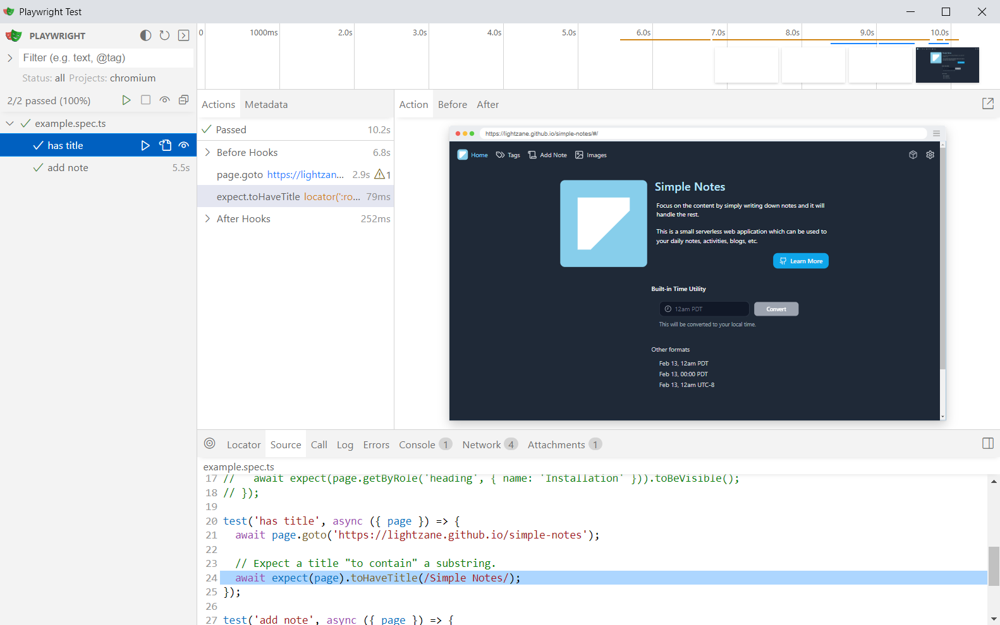
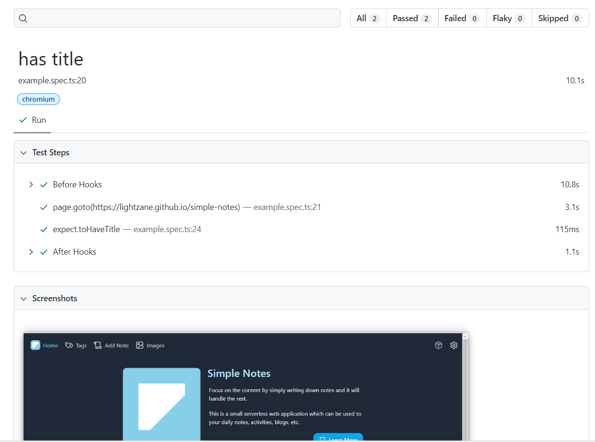

# Try Playwright

https://playwright.dev/docs/intro

# Getting Started

## Create a blank folder

Recommended to start with a blank directory.

## Create `.npmrc` file

Settings this property will install the **Playwright browsers** in your `local` working directory

`.npmrc`

```properties
PLAYWRIGHT_BROWSERS_PATH=0
```

## Install Playwright

```bash
npm init playwright@latest
```

```bash
$ npm init playwright
npm WARN exec The following package was not found and will be installed: create-playwright@1.17.131
Getting started with writing end-to-end tests with Playwright:
Initializing project in '.'
? Do you want to use TypeScript or JavaScript? ...
√ Do you want to use TypeScript or JavaScript? · TypeScript
? Where to put your end-to-end tests? » tests
√ Where to put your end-to-end tests? · tests
? Add a GitHub Actions workflow? (y/N) » false
√ Add a GitHub Actions workflow? (y/N) · false
? Install Playwright browsers (can be done manually via 'npx playwright install'√ Install Playwright browsers (can be done manually via 'npx playwright install')? (Y/n) · false
```

This will also generate `playwright.config.ts`.

## Install Binary Web Browsers

If you did NOT automatically installed **Playwright browsers** during Playwright installation, then you have to install it manually before you can start any test.

```bash
npx playwright install chromium
```

## Running Example Test in Background

```bash
npx playwright test
```

## Running Example Test in Foreground

```bash
npx playwright test --headed
```

You can also specify this in `playwright.config.ts` like so:

```ts
import { defineConfig, devices } from '@playwright/test';

export default defineConfig({
    ...
    projects: [
        {
            name: 'chromium',
            use: {
                ...devices['Desktop Chrome'],
                screenshot: 'on',
                testIdAttribute: 'data-cy' // default: data-testid
                headless: false // --headed
            },
        },
    ]
})
```

## Running Example Test with Playwright UI Mode

```bash
npx playwright test --ui
```



## Show Report

```bash
npx playwright show-report
```


